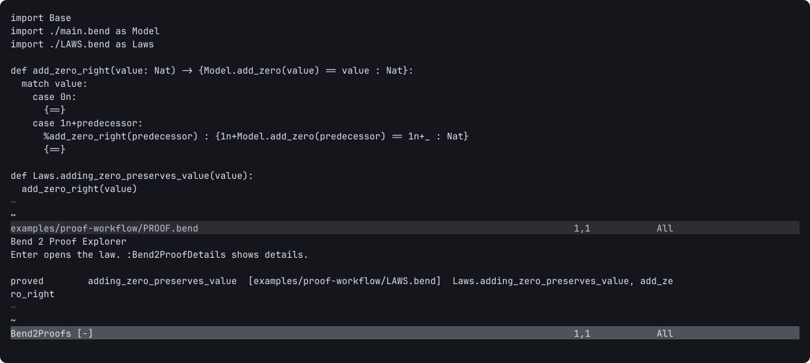
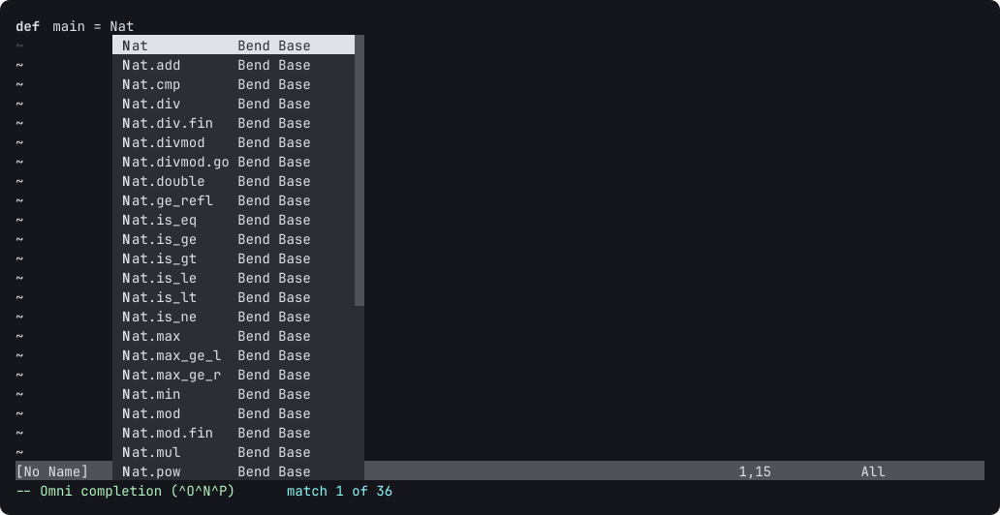

<div align="center">

# Bend 2 for Neovim

Native Lua editing support and compiler tools for [Bend 2](https://github.com/HigherOrderCO/Bend).

[](https://github.com/nuxyel/bend2-nvim/actions/workflows/ci.yml)


</div>

> **Private preview:** this repository is private for now. Installation requires
> GitHub access and Git credentials configured for HTTPS or SSH.

## What it does

- Native Bend file detection, syntax highlighting, indentation, snippets and formatting.
- Parser-backed completion, signatures, symbols, navigation, references, rename and diagnostics.
- Compiler-backed checks and diagnostics, proof workflows, builds, runs and backend comparisons.
- Bend Base completion, fetched asynchronously from the installed compiler.
- Proof Explorer with compiler-verified law status.

Editing features remain available without Bend installed. Compiler-backed features require Bend 2.0.28 or newer. No Node.js, language-server executable, or optional Neovim plugin is required.

## Screenshots

**Proof Explorer** shows a law after the Bend compiler verifies its proof.



**Bend Base completion** includes compiler-provided definitions and identifies their source in the completion menu.



## Install

Bend2.nvim is installed directly from its Git repository; no separate package registry or LuaRocks package is needed. Choose your plugin manager in the [installation guide](docs/INSTALLATION.md):

- [lazy.nvim](docs/INSTALLATION.md#lazy-nvim), supported on Neovim 0.11 and newer.
- [Built-in `vim.pack`](docs/INSTALLATION.md#neovim-vimpack), on Neovim 0.12 and newer.
- [Native package layout](docs/INSTALLATION.md#native-package-layout), including Neovim 0.11 without a plugin manager.

Stable versions use SemVer Git tags and GitHub Releases. The current v1 release remains private along with this repository.

## Configure

```lua
require("bend2").setup({
  cmd = "bend",
  cmd_args = {},
  root_markers = { ".git" },
  validation = "on_save", -- parser | on_save | on_type | off
  diagnostics_mode = "auto", -- auto | text | json
  auto_import = false,
  formatter = true,
})
```

No default key maps are installed. Run `:Bend2Help` for the command list. Start with `:Bend2Check`, `:Bend2Proofs`, or `:Bend2CheckWorkspace`.

## Try the example

The [proof workflow example](examples/proof-workflow/) is also the project used by compiler dogfood in CI. Open it with `nvim examples/proof-workflow/main.bend`, then run `:Bend2CheckWorkspace` and `:Bend2Proofs`.

## Compatibility and support

- Neovim 0.11 and newer; CI covers 0.11.7 and 0.12.5 on Linux x86-64 and macOS arm64.
- Bend 2.0.28 and newer for compiler-backed features; CI verifies Bend 2.0.28 and 2.0.32.
- Windows users can run Neovim and Bend under WSL.

See [support notes](docs/SUPPORT.md), [development guide](docs/DEVELOPMENT.md), [differential checks](docs/DIFFERENTIAL.md), and [release process](docs/RELEASING.md). Report bugs with the [issue template](https://github.com/nuxyel/bend2-nvim/issues/new/choose).

## Contributing and security

Read [CONTRIBUTING.md](CONTRIBUTING.md) before opening a pull request. Please report security issues privately using the process in [SECURITY.md](SECURITY.md); do not disclose vulnerabilities in public issues.

## License

Apache-2.0. See [LICENSE](LICENSE) and [NOTICE](NOTICE).
